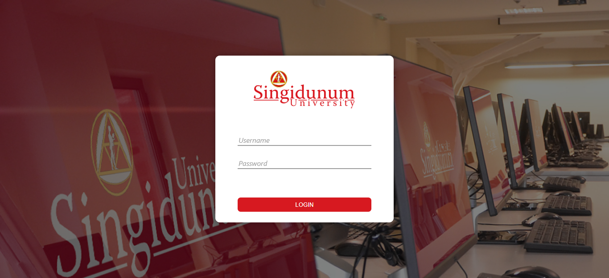
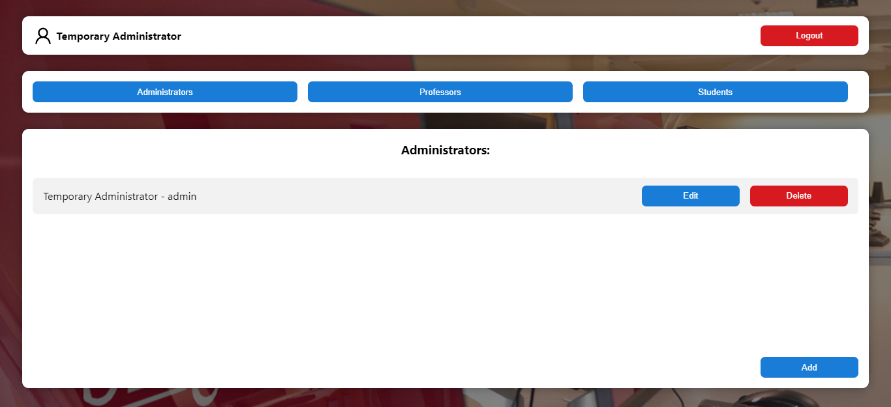
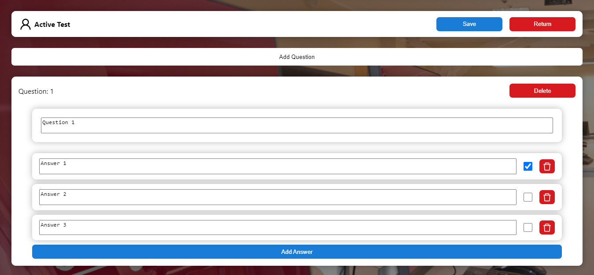
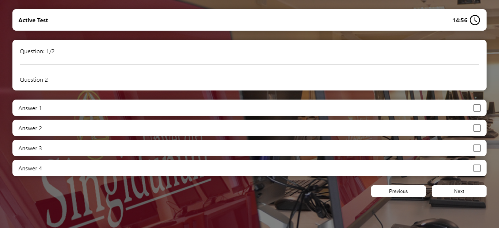
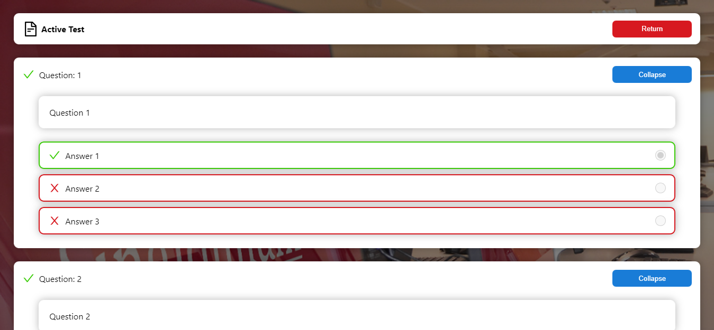

<h1 align="center">Student Testing Platform</h1>

A Frontend application developed for student testing. This frontend was developed as part of a school project designed to learn the fundamentals of RESTful APIs and how they operate.

The source code of the API can be found [HERE](https://github.com/Romario-Stankovic/Student_Testing_Platform_API).

## 💡 Features

Some of the features available are:

- Administrator Panel
- Professor Panel
- Student Panel
- Professors can make and modify tests
- Students can take tests
- Results visible to students and professors

## 🧰 Languages & Tools

  
  
  
  

## 📷 Screenshots

## ⚡ Getting Started

Requirements:

- Web Browser
- Backend API

Guide:

1. Download and run the [API](https://github.com/Romario-Stankovic/Student_Testing_Platform_API)
2. Download the frontend source code
3. Open `studentLogin.html`, `adminLogin.html`, or `professorLogin.html` pages to get started
4. Enjoy :)

## ⚖ License
This repository is not under any license. Normal copyright laws apply!
